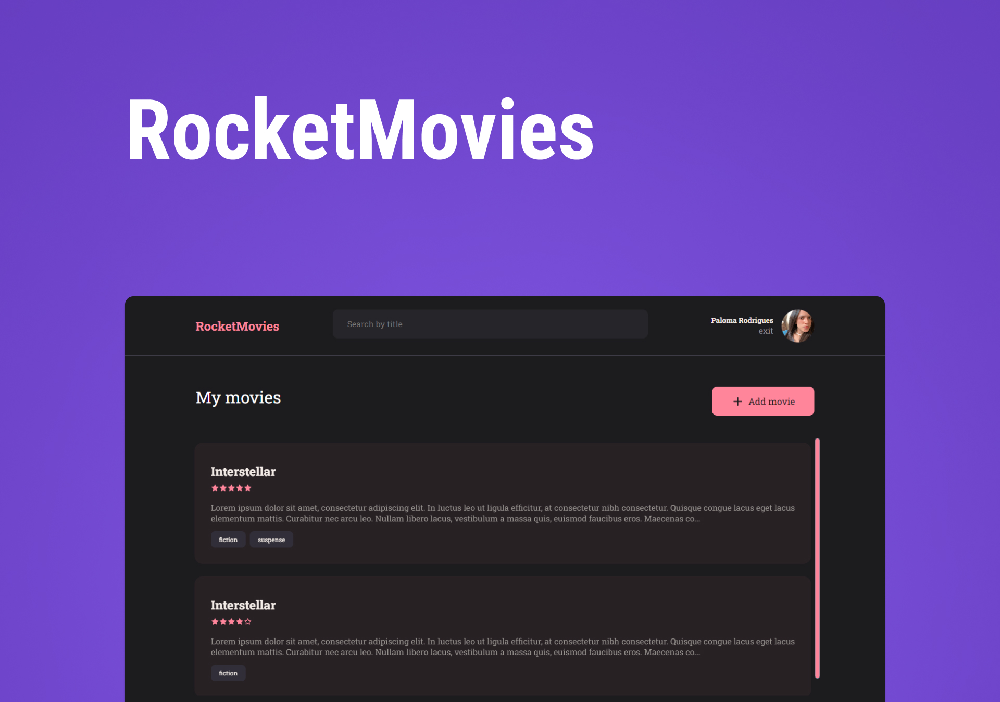

# RocketMovies

<p>RocketMovies is an application to manage watched or favorite movies, with the creation of notes.</p>



</br>

## 🔨 Features

- [x] Sign in / Sign up
- [x] Logout
- [x] Edit Profile
- [x] Search by title
- [x] Create note
- [x] Clear details
- [x] View note
- [x] Delete note

</br>

## 🧪 Tools

- [JavaScript](https://developer.mozilla.org/en-US/docs/Web/JavaScript)
- [React](https://reactjs.org/)
- [Vite](https://vitejs.dev/)
- [Styled-Components](https://styled-components.com/)
- [Axios](https://axios-http.com/docs/intro)

</br>

## 🧭 Getting Started

to run the server you need to have nodejs installed on your machine.

```bash
# in terminal clone this project
$ git clone https://github.com/palomarodrigs/rocketmovies-frontend.git

# access the project folder
$ cd rocketmovies-frontend

# install dependencies
$ npm install

# run server with vitejs
$ npm run dev

```

</br>

## 🚀 Deploy

<p>To access the project click on the link below.</p>

[click here](https://rocketmovies-frontend-mnxyjef8l-palomarodrigs.vercel.app/)

</br>

---

<p align="center">done with ❤️ by  <a href="https://www.linkedin.com/in/paloma-rodrigues-539000233/" target="_blank">Paloma Rodrigues</a></p>
